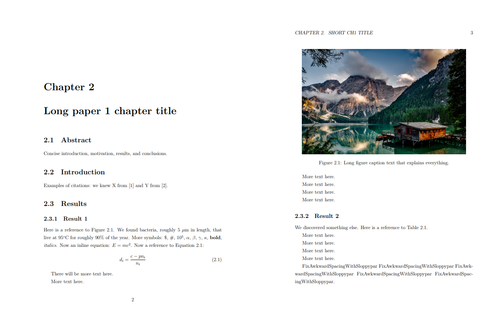

# Stanford LaTeX Thesis Example

## Preview
[View the latest PDF](https://github.com/dcroote/stanford-thesis-example/releases/latest/download/thesis-example.pdf) or click on the image below.

## About
The hope is that this example thesis saves you time that I (and countless others before me) wasted on the minutiae of writing a thesis in LaTeX. It combines a slightly modified version of the existing [Stanford thesis style](https://www.stanford.edu/dept/sul2/etdhelpupload/0/06/Suthesis-2e.sty) ([more Stanford information here](https://library.stanford.edu/research/bibliography-management/latex-bibtex-and-overleaf)) with a template for including figures, tables, inline references, equations, symbols, a bibliography, a signature page, etc... While I have made every attempt to ensure this adheres to Stanford's policies, there are absolutely no guarantees that your thesis will be accepted if it adheres to this template.

### Structure
This template adopts a modular structure where each chapter is a separate `.tex` file that is included by `main.tex`. Figures are similarly organized by publication or project. Citing references requires a bibliography in BibTeX format, which can be generated by exporting an existing collection from a reference manager such as [Mendeley](https://blog.mendeley.com/2012/03/24/how-to-series-generate-bibtex-files-for-your-collections-for-use-in-latex-part-3-of-12/), F1000, etc...

## Usage
1. Install LaTeX on your system, use a [Docker image](https://hub.docker.com/r/dxjoke/tectonic-docker), or use an online service like [Overleaf](https://www.overleaf.com). I used Overleaf because compilation is fast and simple.
2. Clone / download this repository, upload the files to an online service if that is what you are using, and finish your thesis!

## Contributions
Pull requests are welcome for improvements or additions that will benefit others.

## Testing
This example thesis is compiled on Travis CI with the `dxjoke/tectonic-docker` docker image.
